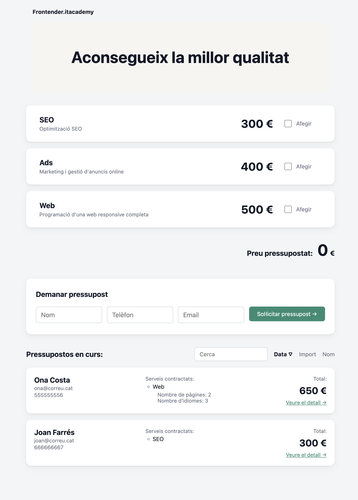

# Pressupostos de serveis digitals

Aplicació SPA feta amb **Angular 22** que permet configurar i calcular el pressupost
d'una web: es trien els serveis, es configuren les opcions de la web i es veu el total
actualitzat al moment. Els pressupostos demanats queden en un històric que es pot
cercar i ordenar, amb una pàgina de detall per a cadascun.

Projecte formatiu del **Sprint 04 de l'IT Academy**.



## Demo

*(Pendent de desplegament.)*

## Posada en marxa

Cal **Node.js 20 o superior**.

```bash
npm install
npm start
```

L'aplicació queda a `http://localhost:4200/`.

## Tests

```bash
npm test
```

Els escenaris estan escrits en **Gherkin** dins dels noms dels tests, amb l'estructura
`Feature` → `Scenario` → `Given / When / Then`, de manera que es llegeixen directament
a la sortida de la comanda.

## Regles de negoci

| Servei | Preu |
|---|---|
| SEO | 300 € |
| Ads | 400 € |
| Web | 500 € de base |

La web és configurable: cada pàgina i cada idioma sumen 30 €.

```
total del servei = preu base + Σ (quantitat × preu unitari de cada opció)
```

Exemple: una web amb 1 pàgina i 3 idiomes val `500 + (1 + 3) × 30 = 620 €`.

## Dades configurables

El catàleg viu a `public/data/services.json` i es carrega en temps d'execució, així que
es poden canviar preus, descripcions, opcions i els textos dels modals informatius
**sense recompilar**.

## Estructura

```
src/app/
├── components/   peces reutilitzables (llista de serveis, total, formulari, històric…)
├── pages/        vistes que pinta el router (inici i detall d'un pressupost)
├── services/     estat compartit (catàleg, pressupost en curs, històric)
├── models/       interfícies de dades
└── utils/        funcions pures (càlcul de preus)
```

Hi ha dues famílies de models: les que descriuen **el catàleg** (`Service`,
`ServiceOption`) i les que descriuen **un pressupost desat** (`SavedBudget`,
`BudgetLine`, `ChosenOption`). Un pressupost desat copia noms i preus del moment en què
es va crear, de manera que un canvi posterior al catàleg no altera els pressupostos
antics.

## Rutes

| Ruta | Vista |
|---|---|
| `/` | configuració del pressupost, formulari i històric |
| `/pressupost/:id` | detall desglossat d'un pressupost desat |

## Accessibilitat

Marcatge semàntic, tots els controls accessibles amb teclat, etiquetes visualment
ocultes per als camps del formulari, `aria-label` als botons d'icona, estats de focus
visibles i regions anunciades amb `aria-live`.

## Disseny responsive

Mobile-first: l'estil base és el de mòbil i s'amplia amb `min-width` als breakpoints de
**40rem** (tauleta) i **64rem** (escriptori).

## Flux de treball amb Git

Git Flow: `main` per a les versions desplegades, `develop` com a branca d'integració i
una branca `feature/…` o `fix/…` per a cada peça, integrada amb `merge --no-ff`.

## Abast

Implementat:

- Èpica 1 — creació i càlcul del pressupost
- Èpica 2 — dades del client i vista de detall
- Èpica 3 — històric amb cerca i ordenació

Fora d'abast, per decisió pròpia:

- **Èpica 4** — compartició per URL i exportació a PDF.
- **Persistència** — l'històric viu només en memòria: en recarregar la pàgina es buida.
- **Textos de la interfície configurables per JSON** — les dades i els textos de negoci
  sí que surten de `services.json`; els textos de la interfície són al codi.
