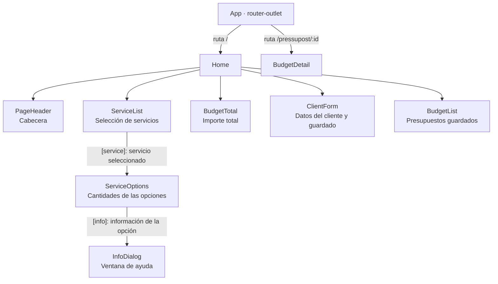
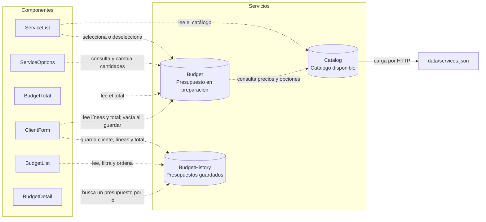

# Relación entre componentes y servicios

En este proyecto hay dos tipos de relación: componentes que contienen otros componentes y componentes que usan servicios para compartir datos.

## 1. Organización de la pantalla

Las flechas indican «muestra dentro de su plantilla».

`ServiceOptions` aparece cuando el servicio está seleccionado y tiene opciones. Desde este componente también se abre `InfoDialog` llamando a `dialog.open()`.

## 2. Conexión con los servicios

Las flechas discontinuas indican «usa mediante `inject()`». Cada etiqueta explica para qué.

## 3. Ejemplo del flujo de datos

1. Seleccionas Web en `ServiceList`, que llama a `Budget.toggle()`.
2. `Budget` actualiza la selección y recalcula las líneas y el total mediante `computed()`.
3. `BudgetTotal` refleja el nuevo total. Si cambias cantidades en `ServiceOptions`, se vuelve a actualizar el presupuesto.
4. Al enviar un formulario válido con algún servicio seleccionado, `ClientForm` pasa los datos del cliente, las líneas y el total a `BudgetHistory.save()`.
5. `ClientForm` reinicia el formulario y vacía el presupuesto en preparación mediante `Budget.clear()`.
6. `BudgetList` muestra el presupuesto guardado y permite navegar a su detalle.
7. `BudgetDetail` recibe el `id` de la ruta y busca ese presupuesto en `BudgetHistory`.

## Ideas clave

- `Home` organiza la pantalla; no inyecta servicios.
- `PageHeader` muestra la cabecera y no utiliza servicios propios del proyecto.
- `InfoDialog` recibe la información mediante un input y controla la ventana de ayuda.
- `Budget` usa `Catalog` para consultar precios y opciones.
- **`ClientForm` es el puente entre `Budget` y `BudgetHistory`**: esos dos servicios no se llaman directamente.
- El historial se conserva en memoria y se pierde al recargar la página.
